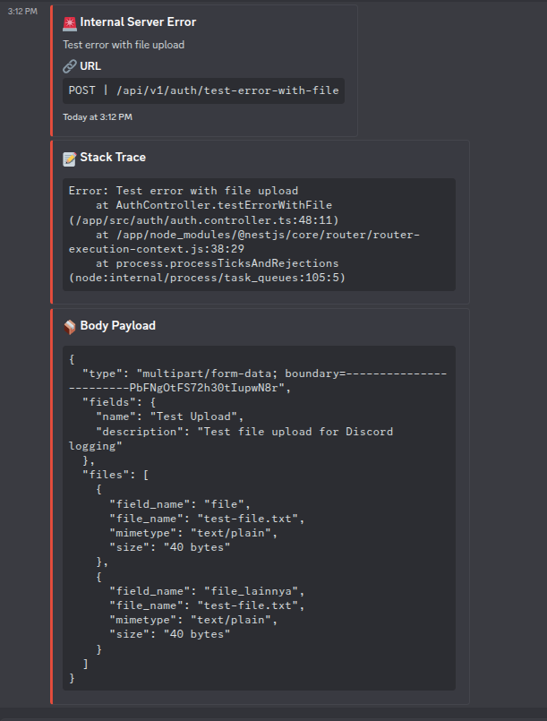

# 📡 ExpSignal

[](https://badge.fury.io/js/%40murbagus%2Fexprsignal)
[](https://opensource.org/licenses/MIT)
[](https://nodejs.org/)

ExpSignal provides an efficient, async solution for capturing and forwarding Express.js request payload logs to Discord channels. Perfect for developers who need quick, reliable error tracking and payload inspection without disrupting app flow.

## ✨ Features

- 🚀 **Async Logging**: Non-blocking Discord webhook integration
- 📦 **Complete Request Capture**: Headers, body, files, and stack traces
- 🎨 **Rich Discord Embeds**: Beautiful, organized message formatting
- 🔍 **File Upload Support**: Handles single and multiple file uploads via Multer
- 📏 **Smart Truncation**: Automatically handles Discord's character limits
- 🛡️ **Error Resilient**: Graceful error handling with fallback logging
- 📱 **TypeScript Ready**: Full TypeScript support with type definitions

## 📋 Preview



## 📦 Installation

```bash
npm install @murbagus/exprsignal
```

## 🚀 Quick Start

### Basic Usage

```typescript
import express from "express";
import { DiscordLogger } from "@murbagus/exprsignal";

const app = express();
const logger = new DiscordLogger("YOUR_DISCORD_WEBHOOK_URL");

app.use(express.json());

// Error handling middleware
app.use(async (error, req, res, next) => {
  // Log error to Discord
  await logger.send(
    req,
    "🚨 Internal Server Error",
    error.message,
    15548997, // Red color
    error.stack
  );

  res.status(500).json({ error: "Internal Server Error" });
});

app.listen(3000, () => {
  console.log("Server running on port 3000");
});
```

### File Upload Integration

```typescript
import multer from "multer";

const upload = multer({ dest: "uploads/" });

app.post("/upload", upload.single("file"), async (req, res) => {
  try {
    // Your file processing logic
    processFile(req.file);

    // Log successful upload
    await logger.send(
      req,
      "✅ File Upload Success",
      `File ${req.file.originalname} uploaded successfully`,
      5763719 // Green color
    );

    res.json({ success: true });
  } catch (error) {
    // Log upload error
    await logger.send(
      req,
      "❌ Upload Failed",
      error.message,
      15548997, // Red color
      error.stack
    );

    res.status(500).json({ error: "Upload failed" });
  }
});
```

### Multiple Files Upload

```typescript
app.post("/upload-multiple", upload.array("files", 5), async (req, res) => {
  try {
    // Process multiple files
    req.files.forEach((file) => processFile(file));

    await logger.send(
      req,
      "📁 Multiple Files Uploaded",
      `Successfully uploaded ${req.files.length} files`,
      5763719
    );

    res.json({ success: true, count: req.files.length });
  } catch (error) {
    await logger.send(
      req,
      "🚨 Batch Upload Error",
      error.message,
      15548997,
      error.stack
    );

    res.status(500).json({ error: "Batch upload failed" });
  }
});
```

## 🎨 Discord Colors

Use these color codes for different message types:

```typescript
const colors = {
  error: 15548997, // Red
  success: 5763719, // Green
  warning: 16776960, // Yellow
  info: 5793266, // Blue
  debug: 9936031, // Purple
};
```

## 📖 API Reference

### Constructor

```typescript
new DiscordLogger(webhookUrl: string)
```

- `webhookUrl`: Your Discord webhook URL

### Methods

#### `send(request, title, message, color, stackTrace?)`

Sends a formatted message to Discord with request details.

**Parameters:**

- `request: Request` - Express request object
- `title: string` - Message title (appears as embed title)
- `message: string` - Main message content
- `color: number` - Discord embed color (decimal format)
- `stackTrace?: string` - Optional stack trace for errors

**Returns:** `Promise<void>`

## 🔧 Getting Discord Webhook URL

1. Go to your Discord server
2. Navigate to **Server Settings** → **Integrations** → **Webhooks**
3. Click **Create Webhook** or **New Webhook**
4. Choose the channel and copy the webhook URL
5. Use the URL in your ExpSignal configuration

## 📊 Request Data Captured

ExpSignal automatically captures and formats:

- **HTTP Method & URL**: Request method and endpoint
- **Request Headers**: Content-Type and other headers
- **Body Fields**: JSON or form data fields
- **File Information**: File name, size, MIME type, field name
- **Stack Trace**: Error stack trace (when provided)
- **Timestamp**: ISO timestamp of the event

## 🛡️ Error Handling

ExpSignal includes built-in error handling:

- **Network Failures**: Logs to console if Discord webhook fails
- **Large Payloads**: Automatically truncates content to fit Discord limits
- **Missing Data**: Gracefully handles missing request properties
- **Invalid Webhooks**: Provides clear error messages for debugging

## 🔍 Testing

Run the included test to verify your setup:

```bash
# Build the project first
npm run build

# Run the test
node test/DiscordLogger.test.js
```

The test will send sample messages to your Discord channel to verify functionality.

## 📋 Requirements

- **Node.js**: 18.0.0 or higher
- **Express.js**: Any version with Request object support
- **Discord Webhook**: Valid webhook URL from Discord server

## 🤝 TypeScript Support

ExpSignal is written in TypeScript and includes full type definitions. No additional `@types` packages needed!

```typescript
import { DiscordLogger } from "@murbagus/exprsignal";
// Full IntelliSense and type checking available
```

## 📄 License

MIT License - see [LICENSE](LICENSE) file for details.

## 👤 Author

**Muhammad Refy** ([refi.bahar@gmail.com](mailto:refi.bahar@gmail.com))

## 🔗 Links

- [GitHub Repository](https://github.com/murbagus/exprsignal)
- [npm Package](https://www.npmjs.com/package/@murbagus/exprsignal)
- [Report Issues](https://github.com/murbagus/exprsignal/issues)

---

### 🚀 Happy Logging with ExpSignal!
